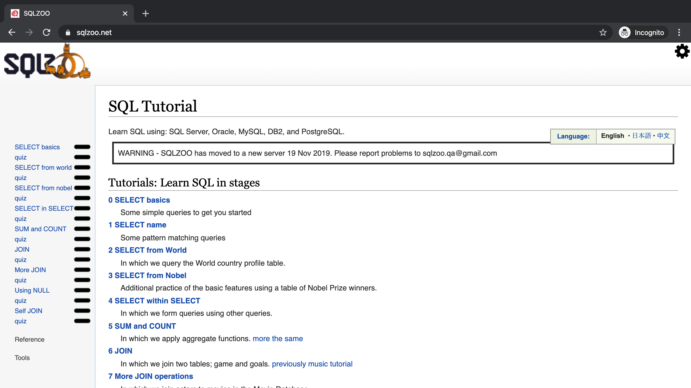

# Project: SQL Zoo

This is my solution to Microverse's fourteenth project. It is the solution for the tutorials 0 to 9 found on the SQL Zoo site.

## Built With

- SQL
- MySQL
- SQL Zoo

## Author

 **David Auza**

- GitHub: [@davidauza-engineer](https://github.com/davidauza-engineer)
- Twitter: [@davidauzaeng](https://twitter.com/davidauzaeng)
- LinkedIn: [David Auza](https://www.linkedin.com/in/davidauza/)

##  License

This project is [MIT](./LICENSE) licensed.
